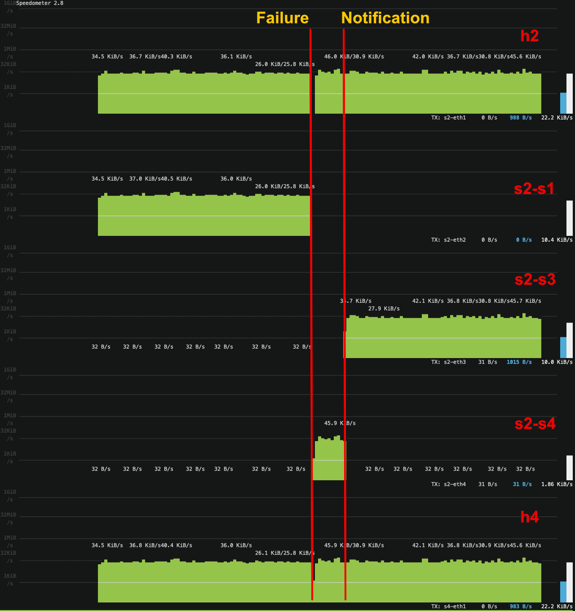
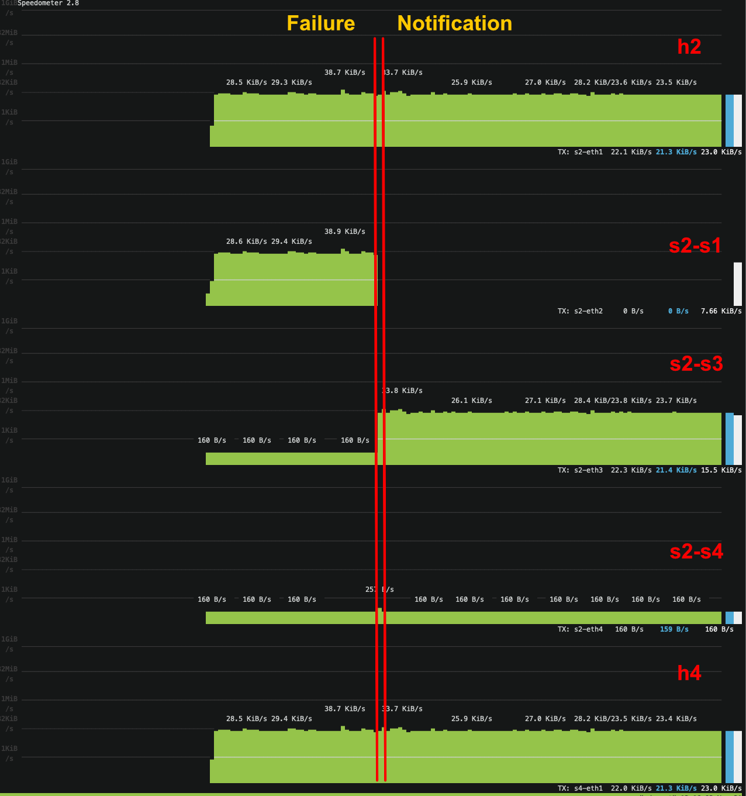

# IP Fast-reroute with Loop-Free Alternate

In this exercise, we will implement a mechanism to fast-reroute traffic upon a failure of an adjacent link towards a Loop-Free Alternate (LFA).
First, we'll introduce the problem and then give you an overview of the basic setup and your tasks.

## Fast-rerouting and Loop-Free Alternates

Consider the following topology, which we'll use throughout the exercise.


The four routers are connected to each other and one host each.
The links between routers have different weights, as shown in the image.
We will assume that there is some mechanism to determine the shortest paths and fill the forwarding tables.
We are using a central controller in this exercise, but an IGP protocol like OSPF could also do this.

In the leftmost figure below, you can see the forwarding path towards `h4`, i.e., the destination prefix `10.4.4.2/24`.
Now consider that the link between `S1` and `S2` fails.
The adjacent routers `S1` and `S2` will be able to detect this failure (almost) immediately, yet it still takes some time until the network can recover:
A central controller needs to be notified about the failure and re-compute the shortest paths, and it needs a protocol such as OSPF to exchange messages and converge.
During this time, all traffic from `S2` and `S3` towards `10.4.4.2/24` is lost.
In our small demo network, this is not very important.
However, in large high-speed networks, recovering from a failure can take several hundreds of milliseconds and many GB of lost traffic.

*Fast-rerouting* aims to close this gap:
In addition to the next hop towards a destination, we can install a (precomputed) *backup* next hop.
Once the router detects a local link failure, it can immediately forward traffic via the backup to ensure connectivity until the central controller/IGP protocol has time to update all forwarding paths optimally.

The backup next-hops must, however, be chosen with care.
Consider, for example, that `S2` uses `S3` as a backup for the failed link towards `S1` (it is the next shortest path) and starts rerouting all traffic towards `10.4.4.2/24`.
Nevertheless, `S3` does not know about the link failure and consequently just forwards the traffic *back* to `S2`, resulting in a routing loop, as you can see in the middle figure below.

To prevent such loops, operators can use IP Fast Reroute with Loop-Free Alternate (LFA). LFAs are backup next hops that *do not result in loops*.
In our case, `S4` is an LFA for traffic towards `10.4.4.2/24`.
Indeed, `S2` can start forwarding traffic to `S4`, and it will reach its destination.

Eventually, when the controller/IGP protocol has updated all paths in response to the failure, traffic can safely be sent via `S3`.


LFAs need to be computed per router for each adjacent link and destination.
As explained, LFAs must not forward traffic back to the source.
This condition can be expressed in terms of distances between nodes.
Let `D(X, Y)` be the distance between node `X` and `Y`. For router `S`, the next hop `N` is an LFA for destination `D`, if:

```
D(N, D) < D(N, S) + D(S, D)
```

Note that this condition considers primarily single link failures.
We will not deal with anything else in this exercise.
For additional consideration of node failures, links with shared risk, and more, please refer to [IP Fast Reroute RFC](https://tools.ietf.org/html/rfc5286).

## Setup

We provide you with a basic setup. Concretely, you'll find the following files:

- `p4app.json` configures the topology introduced above with the help of mininet and the p4-utils package. Note that we disabled `pcap` logging to reduce disk usage. In case you want to use it, you will have to set the option to `true`.
- `network.py`: a Python script that initializes the topology using *Mininet* and *P4-Utils*. One can use indifferently `network.py` or `p4app.json` to start the network.
- `p4src/fast_reroute.p4`: the p4 program to use as a starting point. It already contains two register arrays: `primaryNH` allows looking up the port for a next hop, and `linkState` contains the local link information for a given port (you will be updating it): `0` if there are no issues, `1` if the link is down.
- `p4src/includes`: headers and parsers.
- `controller.py`: the central controller, already capable of installing forwarding rules.
- `heartbeat_generator.py`: a script to generate heartbeat messages from the control plane. The heartbeat messages enable the data planes to detect link failures.
- `topology_generator.py`: a script to generate random topologies.

### Startup

We start by executing `sudo p4run` (or `sudo python network.py`). This starts mininet and all the p4 switches. When mininet is running, open a second terminal or tab, and execute `sudo python controller.py`. This starts the controller script, which computes all shortest paths in the network and installs the corresponding forwarding rules (however you still have to implement some missing parts of the dataplane before you can ping). Afterwards, the controller starts sending heartbeat messages and listening to the switches for failure notifications.

### Failing links


After running the network and the controller, you should be able to ping between hosts, or even run a `pingall` since the provided controller code already populates the basic forwarding rules. You can now fail a specific link in the mininet CLI. For example, executing `link s1 s2 down` command in the mininet CLI fails the link between `S1` and `S2`.
After executing this command, try to `pingall` from the mininet CLI. You will see that the routes using this link are now unreachable.

The routes can become reachable again if the data plane detects the failure and falls back to the backup next hop. The data plane updates the `linkState` registers to keep track of down ports.

The failure detection in the data plane results in a notification packet destined to the controller. The notification triggers the `failure_notification` method in `controller.py`, which updates all forwarding tables. To simulate the delay between a failure detection and the controller update, we have a `notification_delay` parameter in the controller script. This artificial delay enables you to observe the transition period between a failure detection and the controller update.

### Note on IP addresses

For this exercise, we use the IP assignment strategy `l3`, which places each host in a different network.
The IP assigned to host `hX` connected to the switch `SY`
is as follows: `10.Y.X.2`. For example, in the topology above,
`h1` gets `10.1.1.2/24` and `h2` gets `10.2.2.2/24`.
You can find all the documentation about `p4app.json` in the `p4-utils` [documentation](https://nsg-ethz.github.io/p4-utils/usage.html#json).


## Goals

The goal of the exercise is to enable switches to fast-reroute the traffic towards an LFA upon a failure of an adjacent link.
You will need to update both the controller and switch data plane to achieve this.

### Control plane

The controller is already capable of computing the shortest paths, even if some links have failed. You will need to extend it as follows:

- For each switch and link, you must compute an LFA next hop to which the switch can fall back if the link fails.
- You need to install this LFA in the switches.
- While we are working with fixed topology, your controller should be able to work with other topologies as well. Do not hardcode LFAs into your code.

:information_source: Not all topologies allow finding LFAs for any link and destination. In practice, networks are often *designed* such that this is possible.

### Data plane

The switches are already capable of forwarding traffic to the (primary) next hop,
and contain a register array for the link states at each port. Your task is to update these registers when you detect a failed link. This will cause a fast-reroute to the alternative path.
To achieve this, you will need to extend the switch code as follows:

- Detect the heartbeat messages sent from the controller. The heartbeat header includes three fields. The `from_cp` field indicates the heartbeat is received from the controller, and the `port` field indicates for which port this message is intended.
- For the indicated port, get the corresponding timestamp value. This value shows the latest observed heartbeat that has arrived from that port.
- If the time difference between the controller heartbeat and the latest heartbeat received from the adjacent switch is above a threshold, we can infer the link is down. Clone the heartbeat back to the controller to notify the link failure. Send the original heartbeat to its intended destination for other switches to receive.
- If the heartbeat arrives from neighbor switches, update the timestamp value for the received port.
- If the `linkState` register indicates that a link is down, use the backup link instead for forwarding traffic.

:information_source: The controller needs to populate the different primary and backup next hops *prior* to the failure.


## Implementing IP Fast Reroute with LFA

In this section we will give you some implementation guidelines.

### General

In this exercise we try to simplify your life as much as possible, so you can focus on the fast reroute operation.

- The controller knows the MAC address of all hosts, and we have configured all MAC address updates already. We do not use any L2 learning in this exercise.
- You do not have to do load balancing. If two paths have the same cost to reach a destination, just pick any one of the two.
- Your solution does not need to be able to deal with multiple link failures. The LFAs only need to protect against failures of single links at once. We assume that there is sufficient time in between failures for the controller to update the primary and backup next hops. Of course, if you fail too many links, there won't be any LFAs left at some point and even the controller cannot fix this.
- In practice, the network will automatically converge after a failed link. IGP protocols will send out messages automatically, or the controller is automatically notified. In our network, this does not happen, so that you can better observe the effects of link failures. Instead, you can manually `notify` the controller to react to the failed links ([see above](#failing-links)).

### Control plane

On startup, the provided controller already provides full connectivity.
It configures the next hop indices per destination ([more about that below](#data-plane1)), and fills the register array for primary next hops.
This next hop index allows the switch to look up the relevant next hop ports.
In this exercise, we assign a unique next hop index to each host, and you do not need to change this. In practice, more efficient solutions are used, such as grouping destinations that take the same path through the network.

You can put your full attention towards the `update_nexthops` method.
This method fills the register arrays with the actual next hops for each index.
For example, `h1` has the next hop id `0`. If there are no failures, the next
hop towards `h1` at switch `S2` is `S1`, located at port `2`.
Thus, the controller writes `2` to `primaryNH[0]` on `S2`.
If you fail the link between `S1` and `S2`, and `notify` the controller, it updates this register with `3`, the port towards `S3` (along with the registers in other switches).

Your task is to extend this function to not only install the primary next hop,
but also a backup next hop.
You will need to coordinate this with your p4 code, that is, you will first need to update your code such that the controller can actually store the backup next hop somewhere.

When computing the backups, keep in mind that the backup next hops depend on the source router, primary next hop, and the destination.

:information_source: The host itself is also a next hop, although you do not need to compute a backup next hop here, as there is only one link available.

Finally, you need to make sure that you do not install just *any* backup, but an LFA.
To check the LFA condition, you likely need the distances between nodes.
The method `dijkstra` provides you with both the (shortest) distances and paths for each pair of nodes in the network:

```python
failures = (given as input)
distances, paths = self.dijkstra(failures=failures)

distances['s1']['h3']  # Distance from s1 to h3.
paths['s1']['h3']      # Path from s1 to h3.
```

:information_source: Every time you call `dijsktra`, the shortest paths are recomputed, so make sure to not call it unnecessarily often, and re-use its output.


### Data plane

The p4 provided program first applies the table `ipv4_lpm`, which matches on the destination prefix using longest-prefix matching (`lpm`).
However, this table does not immediately map to an egress port, but rather to a next hop index.
These indices are installed once when the controller starts, and need not be modified again.

Using this index, the switch can lookup the corresponding next hop egress port in the `primaryNH` register array.
The controller initially populates these registers, and updates them after failures.

In addition to the primary next hop, you need to implement a way to look up a backup next hop (your LFA).
It might be useful to implement another register array similar to `primaryNH`, but other solutions are also possible.

Finally, you need to put everything together and choose the primary if its link is up, and the backup otherwise.
You can find this information in the `linkState` register array.
The link state of port `X` is stored at index `X` in the register array.
It is `0` if there are no errors, and `1` if the link has failed.
Keep in mind that you *first* need to look up the port of the primary, before you can check whether the link at this port is up.


## Testing your solution

Below, we'll give you some additional tips to debug your program.
As an example, we will consider a failure of the link between `S1` and `S2` and will focus on the rerouting in `S2` for the traffic going to `10.4.4.2/24`, similar to the introduction above.

1.  Start the topology.
    ```bash
    sudo p4run
    ```
    or

    ```bash
    sudo python network.py
    ```

2. Start the controller. As you can see in the code your controller has two
   parameters. First you can set the `heartbeat_frequency` in seconds. And
   secondly, you can set the `notification_delay`. As expalined above, once the
   dataplane detects the failure, it instantaneously reports it to the control
   plane which will update the forwarding state as well as the backups.

    Make sure your `heartbeat_frequency` is smaller than the constant threshold
    defined in the P4 program (`#define THRESHOLD 48w1000000`) otherwise you
    might have false positives. By default, you will find the heart beat set to
    1 second. Thus, it will take at least 1 second before the failure can be
    detected by the dataplane. Feel free to play with the values.

    ```bash
    sudo python controller.py --heartbeat_frequency 0.5 --notification_delay 2
    ```

3.  Verify that you can ping:
    ```bash
    mininet> pingall
    ````

4.  Let's run run the example in the figure above.
    We will monitor five links: S1-h1, S4-h4, and the three adjacent links of `S2`.

    To visualize these five links altogether, we could open separate tcpdumps, or we can use `speedometer`.

    First you need to install `speedometer` with:
    ```bash
    sudo apt-get install speedometer
    ```

    Since `speedometer` is not Python3 compliant, we have to force its execution with Python2. This can be done by running the following command.
    ```bash
    sudo sed -i '1s+^.*$+#!/usr/bin/env python2+' $(which speedometer)
    ```

    Then you can run the following command.
    ```bash
    speedometer -t s2-eth1 -t s2-eth2 -t s2-eth3 -t s2-eth4 -t s4-eth1
    ```

    :information_source: To see the interface names for all switches you can write `net` in the mininet CLI:
    ```
    mininet> net
    h1 h1-eth0:s1-eth1
    h2 h2-eth0:s2-eth1
    h3 h3-eth0:s3-eth1
    h4 h4-eth0:s4-eth1
    s1 lo:  s1-eth1:h1-eth0 s1-eth2:s2-eth2 s1-eth3:s4-eth3 s1-eth4:s3-eth4
    s2 lo:  s2-eth1:h2-eth0 s2-eth2:s1-eth2 s2-eth3:s3-eth2 s2-eth4:s4-eth4
    s3 lo:  s3-eth1:h3-eth0 s3-eth2:s2-eth3 s3-eth3:s4-eth2 s3-eth4:s1-eth4
    s4 lo:  s4-eth1:h4-eth0 s4-eth2:s3-eth3 s4-eth3:s1-eth3 s4-eth4:s2-eth4
    ```

5.  Start a high frequency ping from h2 to h4. Do not use the `mininet` cli
    since we will need it to introduce the link failures. If you are running the
    speedometer, you will see traffic in h2 and h4 direct interfaces, as well as
    in `s2-eth2`.
    ```
    > mx h2
    > ping 10.4.4.2 -i 0.001
    ```

6.  Fail the link S1-S2. For that you can use the mininet cli:
    ```
    mininet> link s1 s2 down
    ```

7. The detection should automatically happen in the dataplane. After 1 second,
   switches will enable the alternative paths. Then, after `notification_delay`
   the controller will update all the switch state with the new optimal paths
   and alternates.

8. We will first try with a threshold of 1 second in the P4 switch, a heart beat
   frequency of 500ms, and a delayed notification of 10 seconds. We set the
   delay quite high so you can see how the switch uses the alternate path and
   once the controller gets notified, the traffic gets sent to an optimal path.

   Once you run your solution you should see something like the image below.
   In the image, can see that `S2` quickly reroutes the traffic to `S4`, which is the LFA
   (`s2-eth4`). After the controller gets notified (10 seconds after) it
   recomputes the shortest paths, `S2` forwards to traffic to `S3`, the new
   primary next hop (traffic crosses `s2-eth3`).
    



9. Now, let us try with some smaller parameters. Modify the P4 program and set
   the detection threshold to 200ms (`#define THRESHOLD 48w200000`). Now
   increase the heartbeat frequency and set notification delay to 0. For
   example:

   ```
   sudo python controller.py --heartbeat_frequency 0.1 --notification_delay 0
   ```

   Now, your speedometer output should look like the image below:



   You can see that by default, now, there is traffic in all the interfaces,
   even if you do not ping. That is because we increased the heartbeat frequency
   which leads to some traffic overhead (not even visible). The biggest
   difference from the previous scenario, is that upon failure detection the
   controller gets instantaneously notified. As consequence, we can see the LFA
   is practically not used at all. Traffic moves from `s2-s1` to `s2-s3`
   instantaneously. Note that, there is a very small spike in traffic in
   `s2-s4`.

## Testing with another topology

When you complete this exercise, you should have a controller that is able to populate the routing tables and registers of any topology. To test that your solution does work with other topologies, you can use the `topology_generator.py` to generate random topologies:

```bash
python topology_generator.py --output_name <name.json> --topo random -n <number of switches to use> -d <average switch degree>
```

This will create a random topology with `n` switches that have on average `d` interfaces (depending on `n`, `d` might not be possible). In addition, each switch will have one host directly connected to it (so `n` hosts).

For example, you can create a random topology with `10` switches and an average degree of `4`:

```bash
python topology_generator.py --output_name 10-switches.json --topo random -n 10 -d 4
```

Run the random topology:

```bash
sudo p4run --config 10-switches.json
```

If you want to use Python scripts instead of JSON files, you may want to run:

```bash
python network_generator.py --output_name 10-switches.py --topo random -n 10 -d 4
```

and
```bash
sudo python 10-switches.py
```

Now run the controller, and check that your can send traffic to all the nodes with `pingall`.

```
mininet> pingall
*** Ping: testing ping reachability
h1 -> h2 h3 h4 h5 h6 h7 h8 h9 h10
h2 -> h1 h3 h4 h5 h6 h7 h8 h9 h10
h3 -> h1 h2 h4 h5 h6 h7 h8 h9 h10
h4 -> h1 h2 h3 h5 h6 h7 h8 h9 h10
h5 -> h1 h2 h3 h4 h6 h7 h8 h9 h10
h6 -> h1 h2 h3 h4 h5 h7 h8 h9 h10
h7 -> h1 h2 h3 h4 h5 h6 h8 h9 h10
h8 -> h1 h2 h3 h4 h5 h6 h7 h9 h10
h9 -> h1 h2 h3 h4 h5 h6 h7 h8 h10
h10 -> h1 h2 h3 h4 h5 h6 h7 h8 h9
*** Results: 0% dropped (90/90 received)
```

Then fail a link, for instance the link between `s2` and `s9` (you can see all the links when writing `links` in the mininet CLI).
Finally, when you run the default p4 and python code, you should see packet loss.

```
mininet> pingall
*** Ping: testing ping reachability
h1 -> h2 h3 h4 h5 h6 h7 h8 h9 h10
h2 -> h1 h3 h4 X h6 h7 h8 X h10
h3 -> h1 h2 h4 h5 h6 h7 h8 h9 h10
h4 -> h1 h2 h3 h5 h6 h7 h8 h9 h10
h5 -> h1 X h3 h4 h6 h7 h8 h9 h10
h6 -> h1 h2 h3 h4 h5 h7 h8 h9 h10
h7 -> h1 h2 h3 h4 h5 h6 h8 h9 h10
h8 -> h1 h2 h3 h4 h5 h6 h7 h9 h10
h9 -> h1 X h3 h4 h5 h6 h7 h8 h10
h10 -> h1 h2 h3 h4 h5 h6 h7 h8 h9
*** Results: 4% dropped (86/90 received)
```

However, with IP fast reroute to LFA implemented, you should not see packet loss.

:information_source: Keep in mind that in a random topology, it might be impossible to find LFAs for some links. If your solution does not work, first check whether it is even possible to find an LFA for the link you failed.
